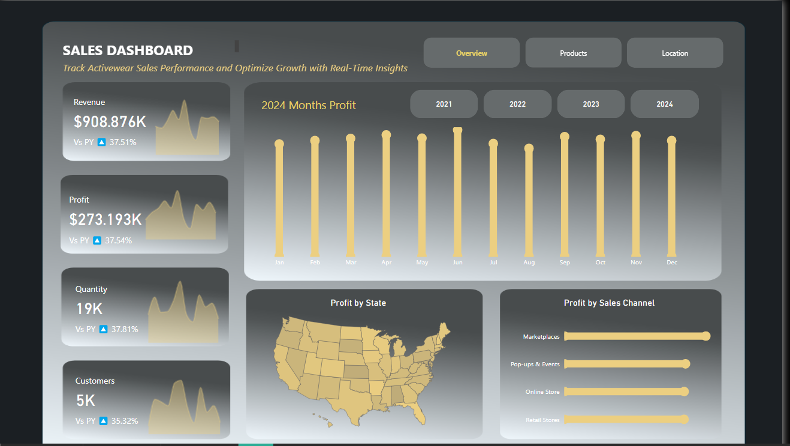
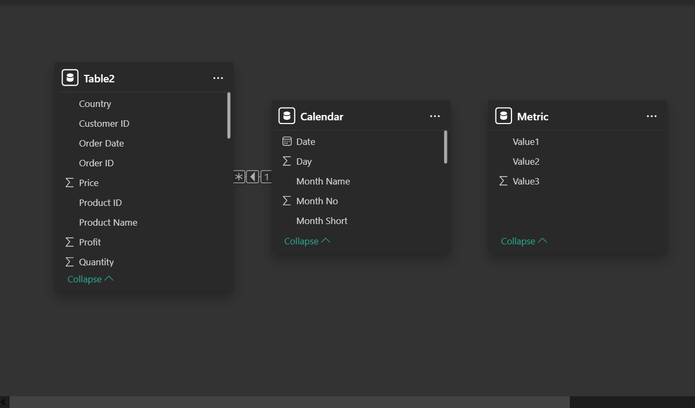
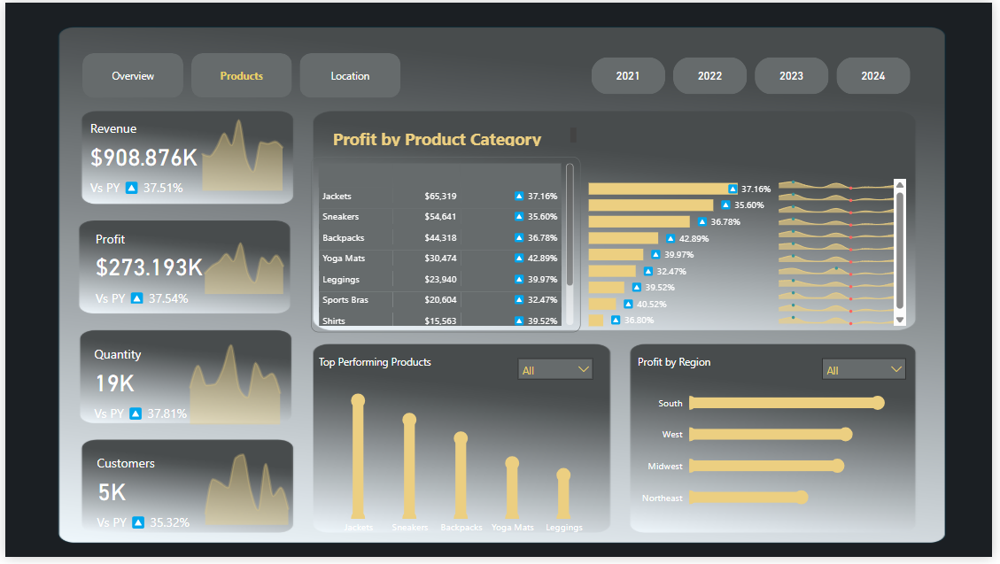
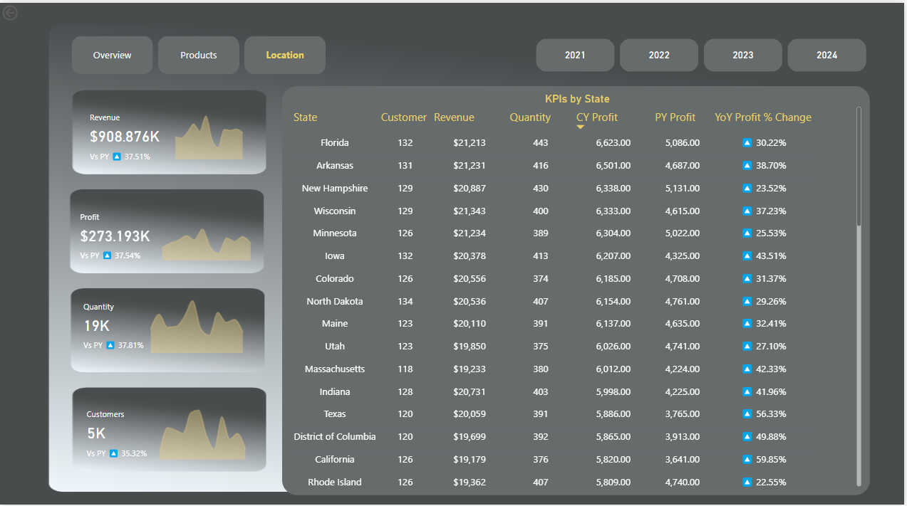
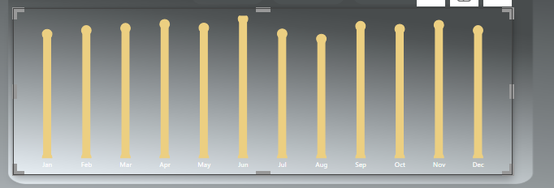
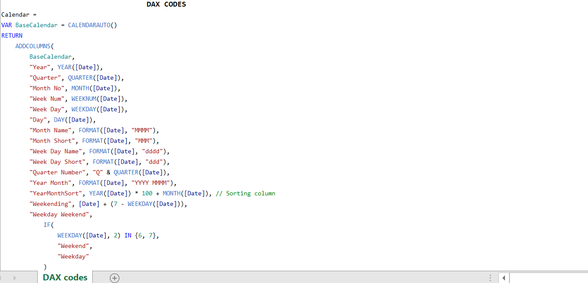

# Activewear Sales Performance: Where Should the Business Grow?

**A sales performance analysis of four years of activewear orders, turned into an interactive Power BI dashboard and practical recommendations.**

**Skills:** Power BI · DAX · Power Query · Data modelling · KPI design · Year-on-year analysis · Pareto analysis · Stakeholder-focused recommendations

### Key findings

- **5 of 9 products drive 80% of profit**, led by jackets, sneakers and backpacks
- **The online store is the fastest-growing channel**, with profit up 32.6% in 2024 while pop-ups and events fell 7%
- **Only 22% of customers buy more than once**, so retention is the biggest untapped growth lever

[**View the dashboard (PDF)**](Wears_Dashboard.pdf)

---

## 1. The business problem

An activewear retailer sells nine product lines across four channels (marketplaces, its online store, retail stores, and pop-ups and events) in all 50 US states. Sales grew in 2022, dipped slightly in 2023, and recovered in 2024, but the business had no single view of **what was driving performance** or **where to focus next**.

This analysis answers five questions a sales or commercial director would ask:

1. How is the business performing year on year?
2. Which products earn the most profit, and which are slipping?
3. Which sales channels and regions should get more investment?
4. Are there seasonal peaks to plan around?
5. Are customers coming back?

## 2. The data

- **6,250 order lines** from January 2021 to December 2024
- **5,000 customers**, 9 products, 4 sales channels, 4 regions, 50 states
- Modelled as three tables: **sales**, **calendar** and **product**

## 3. How I built it

| Step | What I did |
|---|---|
| Clean and prepare | Cleaned and transformed the raw data in Power Query, and checked for missing values and duplicates |
| Calendar | Built a calendar table with Year, Month, Month number and Day columns |
| Model | Linked the calendar to the sales data with a one-to-many relationship, so every KPI can be compared year on year |
| Measures | Created a dedicated measures table: revenue, profit, quantity and customers, each against the previous year, plus year-on-year % change |
| Interactivity | Used a parameter table so users can switch the metric shown in visuals, and added slicers for year, state, region, sales channel and metric |
| Navigation and design | Added button navigation between three pages (Overview, Products, Location) and a custom background designed in PowerPoint |

## 4. What the data shows

### Steady margins, uneven growth

| Year | Revenue | Profit | Revenue growth | Profit margin |
|---|---|---|---|---|
| 2021 | $200,476 | $60,478 | | 30.2% |
| 2022 | $231,391 | $69,358 | +15.4% | 30.0% |
| 2023 | $229,107 | $68,834 | -1.0% | 30.0% |
| 2024 | $247,935 | $74,566 | +8.2% | 30.1% |

Margins held at about 30% every year, so growth comes from selling more, not from pricing. The 2023 dip was small, and 2024 rebounded strongly, with revenue up 8.2% and profit up 8.3%.

### A few products carry the business

| Product | Share of total profit | Profit change in 2024 |
|---|---|---|
| Jackets | 23.9% | +13.5% |
| Sneakers | 20.0% | +11.4% |
| Backpacks | 16.2% | +8.6% |
| Yoga Mats | 11.2% | +14.4% |
| Leggings | 8.8% | -2.9% |
| Sports Bras | 7.5% | -7.7% |

The top five products earn **80% of profit**, a classic 80/20 pattern. Three products declined in 2024: sports bras, leggings and socks.

### Marketplaces earn the most, the online store grows the fastest

| Channel | Share of profit | Profit change in 2024 |
|---|---|---|
| Marketplaces | 28.2% | +11.1% |
| Pop-ups & Events | 24.1% | -7.0% |
| Online Store | 23.9% | **+32.6%** |
| Retail Stores | 23.8% | +0.1% |

Marketplaces are the biggest channel overall, but the online store grew three times faster in 2024. Pop-ups and events were the only channel to shrink.

### The South leads, but no single state stands out

The South is the most profitable region, earning **31% of profit** overall and $23,630 in 2024. The Northeast earns only 18.5%.

Wisconsin has the highest total revenue, but only just: the top five states are all within $450 of each other over four years, and the top state changes from year to year. Sales are spread evenly across states, so there's no single "star" state to target.

### No reliable seasonal peak

June has the highest revenue across all four years combined, but it wasn't the best month in any single year. The best month changed every year (November, December, October and February). Sales are fairly steady through the year, so stock and staffing can be planned evenly rather than around one peak.

### Most customers buy only once

Only **22% of customers placed more than one order**. With 5,000 customers averaging 1.2 orders each, getting even a small share of one-off buyers to come back would add revenue without the cost of finding new customers.

## 5. Recommendations

1. **Protect the top five products.** They earn 80% of profit, so keep them well stocked and prioritise them in promotions.
2. **Invest in the online store.** It's the fastest-growing channel and keeps the full margin, unlike third-party marketplaces. Support it with SEO, social media and email campaigns.
3. **Keep improving marketplace listings.** Marketplaces are still the biggest channel, so better product listings and targeted ads protect that base.
4. **Review pop-ups and events.** It's the only channel that shrank in 2024. Check the cost of running events against the profit they bring in.
5. **Launch a repeat-purchase programme.** With 78% of customers buying once, email follow-ups and loyalty offers to past buyers are the cheapest way to grow.
6. **Investigate the three declining products** before cutting them. Sports bras and leggings may be facing price or competition pressure worth understanding.
7. **Grow the Northeast.** It's the weakest region, so test targeted campaigns there before committing more spend.

## 6. Dashboard design decisions

- **KPIs first.** Revenue, profit, quantity and customers sit down the left on every page, each with a sparkline and the change against the previous year.
- **Year buttons instead of dropdowns,** so users switch years in one click.
- **Three focused pages** (Overview, Products, Location), each answering one question, rather than one crowded page.

## 7. Limitations and next steps

- **Year comparisons need a year selected.** With no year chosen, the "vs previous year" cards compare all four years against the previous three, which overstates growth. The next version will default to the latest year.
- **No cost or marketing data,** so recommendations focus on where profit comes from, not on the return from spending.
- **Next step:** add a customer page showing new versus returning customers over time, to track the retention recommendation.

---

## Files

| File | What it is |
|---|---|
| [Wears_Dashboard.pdf](Wears_Dashboard.pdf) | All three dashboard pages |
| [My_Active_datawear.xlsx](My_Active_datawear.xlsx) | Source data |
| [Completed Background.pptx](Completed%20Background.pptx) | Dashboard background design |

**Felicia Oyebode** · [LinkedIn](https://www.linkedin.com/in/felicia-oyebode-587353197/) · [Portfolio](https://lolabode.github.io)
